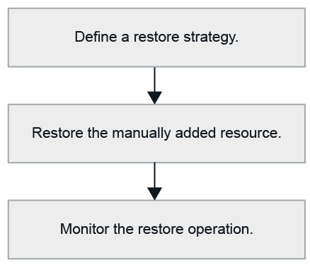

= Wiederherstellung des Workflows
:allow-uri-read: 
:icons: font
:imagesdir: ../media/

[role="lead"]
Der Restore- und Recovery-Workflow umfasst Planung, Durchführung von Restore-Vorgängen und Monitoring von Vorgängen.

Der folgende Workflow zeigt die Reihenfolge, in der Sie den Wiederherstellungsvorgang durchführen müssen:

Außerdem können Sie PowerShell Cmdlets manuell oder in Skripten verwenden, um Backup-, Wiederherstellungs- und Klonvorgänge durchzuführen. Die SnapCenter Cmdlet Hilfe und die Cmdlet Referenzinformationen enthalten detaillierte Informationen zu PowerShell Cmdlets.

https://docs.netapp.com/us-en/snapcenter-cmdlets/index.html["SnapCenter Software Cmdlet Referenzhandbuch"^].
