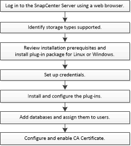

= Installationsworkflow des SnapCenter Plug-ins für SAP HANA Database
:allow-uri-read: 
:icons: font
:imagesdir: ../media/

[role="lead"]
Sie sollten das SnapCenter Plug-in für SAP HANA Database installieren und einrichten, wenn Sie SAP HANA Datenbanken schützen möchten.

