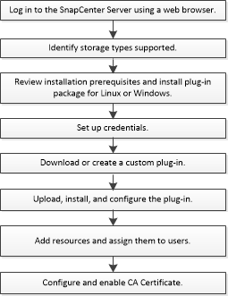

= Installationsworkflow von benutzerdefinierten SnapCenter Plug-ins
:allow-uri-read: 
:icons: font
:imagesdir: ../media/

[role="lead"]
Sie sollten benutzerdefinierte SnapCenter-Plug-ins installieren und einrichten, wenn Sie benutzerdefinierte Plug-in-Ressourcen schützen möchten.

link:develop_a_plug_in_for_your_application.html["Entwickeln Sie ein Plug-in für Ihre Applikation"]
