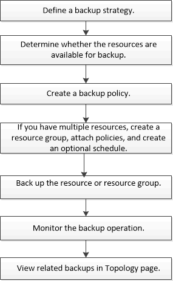

= Backup-Workflow
:allow-uri-read: 
:icons: font
:imagesdir: ../media/

[role="lead"]
Wenn Sie das SnapCenter Plug-in für Microsoft Exchange Server in Ihrer Umgebung installieren, können Sie mit SnapCenter Exchange-Ressourcen sichern.

Sie können mehrere Backups so planen, dass sie gleichzeitig über mehrere Server ausgeführt werden. Backup- und Restore-Vorgänge können nicht gleichzeitig auf derselben Ressource durchgeführt werden. Aktive und passive Backup-Kopien auf demselben Volume werden nicht unterstützt.

Der folgende Workflow zeigt die Reihenfolge, in der Sie den Sicherungsvorgang durchführen müssen:

