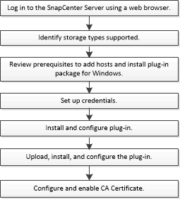

= Installations-Workflow des SnapCenter Plug-ins für Microsoft Exchange Server
:allow-uri-read: 
:icons: font
:imagesdir: ../media/

[role="lead"]
Sie sollten das SnapCenter Plug-in für Microsoft Exchange Server installieren und einrichten, wenn Sie Exchange-Datenbanken schützen möchten.

