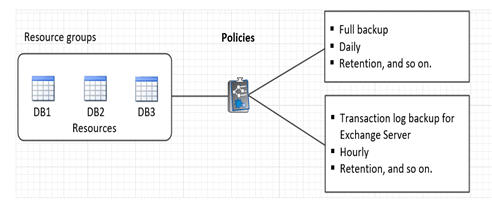

= Bereiten Sie sich auf die Datensicherung vor
:allow-uri-read: 
:icons: font
:imagesdir: ../media/

[role="lead"]
Bevor Sie Datensicherungsvorgänge wie Backup-, Klon- oder Restore-Vorgänge durchführen, müssen Sie Ihre Strategie definieren und die Umgebung festlegen. Sie können den SnapCenter Server auch zur Verwendung von SnapMirror und SnapVault Technologie einrichten.

Um von der SnapVault und SnapMirror Technologie zu profitieren, müssen Sie eine Datensicherungsbeziehung zwischen den Quell- und Ziel-Volumes auf dem Storage-Gerät konfigurieren und initialisieren. Sie können entweder NetApp System Manager verwenden oder die Storage-Konsole verwenden, um diese Aufgaben auszuführen.

*Weitere Informationen*

link:https://docs.netapp.com/us-en/ontap-automation/getting_started_with_the_rest_api.html["Erste Schritte mit DER REST API"]

== Voraussetzungen für die Verwendung des SnapCenter-Plug-ins für Microsoft Exchange Server

Bevor Sie das Plug-in für Exchange verwenden, muss der SnapCenter-Administrator den SnapCenter-Server installieren und konfigurieren und die erforderlichen Aufgaben ausführen.

* Installation und Konfiguration von SnapCenter Server
* Melden Sie sich bei SnapCenter an.
* Konfigurieren Sie die SnapCenter-Umgebung, indem Sie Storage-Systemverbindungen hinzufügen oder zuweisen und Anmeldedaten erstellen.
+

NOTE: SnapCenter unterstützt nicht mehrere SVMs mit demselben Namen auf verschiedenen Clustern. Jede von SnapCenter unterstützte SVM muss über einen eindeutigen Namen verfügen.

* Fügen Sie Hosts hinzu, installieren Sie das SnapCenter Plug-in für Microsoft Windows und das SnapCenter Plug-in für Microsoft Exchange Server und ermitteln Sie die Ressourcen (aktualisieren).
* Führen Sie die Host-seitige Storage-Bereitstellung mit dem SnapCenter Plug-in für Microsoft Windows durch.
* Wenn Sie SnapCenter Server zum Schutz von Exchange Datenbanken verwenden, die sich auf VMware RDM LUNs befinden, müssen Sie das SnapCenter Plug-in für VMware vSphere implementieren und das Plug-in mit SnapCenter registrieren. Die Dokumentation zum SnapCenter Plug-in für VMware vSphere enthält weitere Informationen.
+

NOTE: VMDKs werden nicht unterstützt.

* Verschieben Sie eine vorhandene Microsoft Exchange Server-Datenbank von einem lokalen Laufwerk auf unterstützten Speicher mithilfe von Microsoft Exchange-Tools.
* Richten Sie SnapMirror- und SnapVault-Beziehungen ein, falls Sie eine Backup-Replizierung möchten.

Für Nutzer von SnapCenter 4.1.1 enthält die Dokumentation zum SnapCenter Plug-in für VMware vSphere 4.1.1 Informationen zum Schutz von virtualisierten Datenbanken und Dateisystemen. Für Nutzer von SnapCenter 4.2.x, die NetApp Data Broker 1.0 und 1.0.1, enthält Dokumentation Informationen zum Schutz von virtualisierten Datenbanken und Dateisystemen mithilfe des SnapCenter Plug-ins für VMware vSphere, das durch die Linux-basierte NetApp Data Broker Virtual Appliance (Open Virtual Appliance Format) bereitgestellt wird. Für SnapCenter 4.3.x-Anwender enthält die Dokumentation zum SnapCenter Plug-in für VMware vSphere 4.3 Informationen zum Schutz virtualisierter Datenbanken und Filesysteme mithilfe des Linux-basierten SnapCenter Plug-ins für VMware vSphere Virtual Appliance (Open Virtual Appliance Format).

https://docs.netapp.com/us-en/sc-plugin-vmware-vsphere/["Dokumentation zum SnapCenter Plug-in für VMware vSphere"^]

== Wie Ressourcen, Ressourcengruppen und Richtlinien zum Schutz von Exchange Server verwendet werden

Bevor Sie SnapCenter verwenden, ist es hilfreich, grundlegende Konzepte im Zusammenhang mit den durchzustellenden Backup-, Restore- und erneuten Seeding-Operationen zu verstehen. Sie interagieren mit Ressourcen, Ressourcengruppen und Richtlinien für verschiedene Vorgänge.

* Ressourcen sind typischerweise Mailbox-Datenbanken oder Microsoft Exchange Database Availability Group (DAG), die Sie mit SnapCenter sichern.
* Eine SnapCenter Ressourcengruppe ist eine Ansammlung von Ressourcen auf einem Host oder einer Exchange DAG, und die Ressourcengruppe kann entweder eine ganze DAG oder einzelne Datenbanken enthalten.
+
Wenn Sie einen Vorgang für eine Ressourcengruppe ausführen, führen Sie diesen Vorgang für die in der Ressourcengruppe definierten Ressourcen gemäß dem von Ihnen für die Ressourcengruppe festgelegten Zeitplan aus.

+
Sie können nach Bedarf eine einzelne Ressource oder eine Ressourcengruppe sichern. Sie können auch geplante Backups für einzelne Ressourcen und Ressourcengruppen durchführen.

+
Die Ressourcengruppen wurden früher als Datensätze bezeichnet.

* Die Richtlinien legen die Backup-Häufigkeit, die Aufbewahrung von Kopien, Skripte und andere Eigenschaften von Datensicherungsvorgängen fest.
+
Wenn Sie eine Ressourcengruppe erstellen, wählen Sie eine oder mehrere Richtlinien für diese Gruppe aus. Sie können auch eine oder mehrere Richtlinien auswählen, wenn Sie ein Backup nach Bedarf für eine einzelne Ressource durchführen.

Denken Sie an eine Ressourcengruppe, die definiert _was_ Sie schützen möchten und wann Sie sie in Bezug auf Tag und Zeit schützen möchten. Denken Sie an eine Politik, die definiert _wie_ Sie sie schützen möchten. Wenn Sie beispielsweise alle Datenbanken eines Hosts sichern, können Sie eine Ressourcengruppe erstellen, die alle Datenbanken des Hosts enthält. Sie können dann zwei Richtlinien an die Ressourcengruppe anhängen: Eine Tagesrichtlinie und eine Stundenpolitik. Wenn Sie die Ressourcengruppe erstellen und die Richtlinien anhängen, können Sie die Ressourcengruppe so konfigurieren, dass sie täglich ein vollständiges Backup durchführt, und einen anderen Zeitplan, der stündlich Protokoll-Backups durchführt. Das folgende Bild veranschaulicht die Beziehung zwischen Ressourcen, Ressourcengruppen und Richtlinien für Datenbanken:

