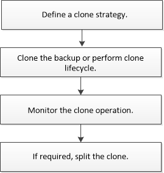

= Klon-Workflow
:allow-uri-read: 
:icons: font
:imagesdir: ../media/

[role="lead"]
Vor dem Klonen von Datenbankressourcen aus einem Backup müssen Sie mehrere Aufgaben mit SnapCenter Server ausführen. Beim Datenbankklonen wird eine zeitpunktgenaue Kopie einer Produktionsdatenbank oder des zugehörigen Backup-Satzes erstellt. Sie können Datenbanken klonen, um Funktionen zu testen, die mit der aktuellen Datenbankstruktur und dem Inhalt während der Anwendungsentwicklungszyklen implementiert werden müssen, um die Werkzeuge zur Datenextraktion und -Bearbeitung beim Befüllen von Data Warehouses zu verwenden oder Daten, die versehentlich gelöscht oder geändert wurden, wiederherzustellen.

Bei einem Datenbankklonen werden Berichte auf Basis der Job-IDs erstellt.

Im folgenden Workflow ist die Reihenfolge aufgeführt, in der Sie die Klonvorgänge ausführen müssen:

Außerdem können Sie PowerShell Cmdlets manuell oder in Skripten verwenden, um Backup, Wiederherstellung, Wiederherstellung, Verifizierung und Klonvorgänge durchzuführen. Ausführliche Informationen zu PowerShell Cmdlets finden Sie in der Hilfe zu SnapCenter Cmdlet oder in der https://library.netapp.com/ecm/ecm_download_file/ECMLP2885482["SnapCenter Software Cmdlet Referenzhandbuch"]

*Weitere Informationen*

link:task_clone_from_a_sql_server_database_backup.html["Klonen aus einem Backup der SQL Server Datenbank"]

link:task_perform_clone_lifecycle_management.html["Führen Sie Den Klon-Lebenszyklus Durch"]

link:https://kb.netapp.com/Advice_and_Troubleshooting/Data_Protection_and_Security/SnapCenter/Clone_operation_might_fail_or_take_longer_time_to_complete_with_default_TCP_TIMEOUT_value["Der Klonvorgang kann fehlschlagen oder längere Zeit zum Abschließen mit dem Standardwert für TCP_TIMEOUT benötigen"]
