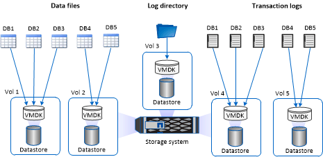

= Empfehlungen für das Storage-Layout für das SnapCenter Plug-in für Microsoft SQL Server
:allow-uri-read: 
:icons: font
:imagesdir: ../media/

[role="lead"]
Mit dem gut durchdachten Storage-Layout kann SnapCenter Server Ihre Datenbanken entsprechend den Recovery-Vorgaben sichern. Bei der Definition des Storage-Layouts sollten Sie mehrere Faktoren berücksichtigen, darunter die Größe der Datenbank, die Änderungsrate der Datenbank und die Häufigkeit, mit der Sie Backups durchführen.

In den folgenden Abschnitten werden die Empfehlungen und Einschränkungen des Storage-Layouts für LUNs und Virtual Machine Disks (VMDKs) mit dem SnapCenter Plug-in für Microsoft SQL Server in Ihrer Umgebung definiert.

In diesem Fall können LUNs VMware RDM-Festplatten und die dem Gast zugeordneten iSCSI-Direct-Attached LUNs enthalten.

== LUN- und VMDK-Anforderungen

Sie können optional dedizierte LUNs oder VMDKs für eine optimale Performance und ein optimales Management für die folgenden Datenbanken verwenden:

* Master- und Modellsystemdatenbanken
* Tempdb
* Benutzerdatenbankdateien (.mdf und .ndf)
* Log-Dateien der Benutzerdatenbank-Transaktionen (.ldf)
* Protokollverzeichnis

Zur Wiederherstellung großer Datenbanken empfiehlt es sich, dedizierte LUNs oder VMDKs zu verwenden. Die zur Wiederherstellung einer vollständigen LUN oder VMDK benötigte Zeit beträgt weniger als die Zeit zur Wiederherstellung der in der LUN oder VMDK gespeicherten einzelnen Dateien.

Für das Log-Verzeichnis sollten Sie eine separate LUN oder VMDK erstellen, damit genügend freier Speicherplatz in den Daten- oder Log-Datei-Disks vorhanden ist.

== Beispiellayouts für LUN und VMDK

Die folgende Grafik zeigt, wie Sie das Storage-Layout für große Datenbanken auf LUNs konfigurieren können:

image::../media/smsql_storage_layout_mult_vols_snapcenter.gif[Diagramm mit mehreren LUNs]

Die folgende Grafik zeigt, wie Sie das Storage-Layout für mittelgroße oder kleine Datenbanken auf LUNs konfigurieren können:

image::../media/smsql_storage_layout_mult_dbs_luns_snapcenter.gif[Mehrere Datenbanken pro LUN-Diagramm]

Die folgende Grafik zeigt, wie Sie das Storage-Layout für große Datenbanken auf VMDKs konfigurieren können:

image::../media/smsql_storage_layout_large_dbs_vmdk.gif[Storage-Layout für große Datenbanken auf VMDKs]

Die folgende Grafik zeigt, wie Sie das Storage-Layout für mittelgroße oder kleine Datenbanken auf VMDKs konfigurieren können:

