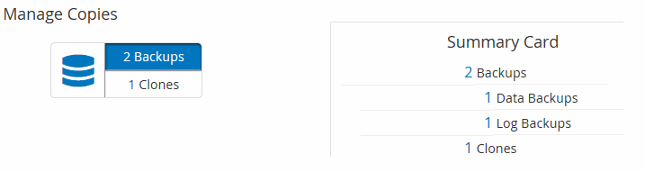

= Sehen Sie sich zugehörige Backups und Klone auf der Seite Topologie an
:allow-uri-read: 
:icons: font
:imagesdir: ../media/

[role="lead"]
Wenn Sie die Erstellung von Backups oder Klonen einer Ressource vorbereiten, können Sie eine grafische Darstellung aller Backups und Klone auf dem primären und sekundären Storage anzeigen. Auf der Seite Topology sehen Sie alle Backups und Klone, die für die ausgewählte Ressource oder Ressourcengruppe zur Verfügung stehen. Sie können die Details zu diesen Backups und Klonen anzeigen und diese dann zur Durchführung von Datensicherungsvorgängen auswählen.

*Über diese Aufgabe*

In der Ansicht Kopien managen können Sie die folgenden Symbole überprüfen, um festzustellen, ob die Backups und Klone auf dem primären oder sekundären Storage (Mirror-Kopien oder Vault-Kopien) verfügbar sind.

* image:../media/topology_primary_storage.gif["Symbol für primären Speicher"] Zeigt die Anzahl der Backups und Klone an, die auf dem primären Speicher verfügbar sind.
* image:../media/topology_mirror_secondary_storage.gif["Symbol für sekundären Speicherspiegel"] Zeigt die Anzahl der Backups und Klone an, die mithilfe der SnapMirror Technologie auf dem sekundären Storage gespiegelt werden.
+

NOTE: Klone eines Backups einer versionsflexiblen Spiegelung auf einem Volume vom Typ Mirror werden in der Topologieansicht angezeigt, aber die Anzahl der gespiegelten Backups in der Topologieansicht umfasst nicht das versionsflexible Backup.

* image:../media/topology_vault_secondary_storage.gif["Symbol für sekundären Tresor"] Zeigt die Anzahl der Backups und Klone an, die mithilfe der SnapVault Technologie auf dem sekundären Storage repliziert werden.
+
** Die Anzahl der angezeigten Backups umfasst die Backups, die aus dem sekundären Speicher gelöscht wurden. Wenn Sie beispielsweise 6 Backups mit einer Richtlinie erstellt haben, um nur 4 Backups aufzubewahren, werden die Anzahl der angezeigten Backups 6 angezeigt.
** Wenn Sie ein Upgrade von SnapCenter 1.1 durchgeführt haben, werden die Klone auf dem sekundären (Mirror oder Vault) nicht unter Mirror-Kopien oder Vault-Kopien in der Topologieseite angezeigt. Alle mit SnapCenter 1.1 erstellten Klone werden unter den lokalen Kopien in SnapCenter 3.0 angezeigt.

NOTE: Klone eines Backups einer versionsflexiblen Spiegelung auf einem Volume vom Typ Mirror werden in der Topologieansicht angezeigt, aber die Anzahl der gespiegelten Backups in der Topologieansicht umfasst nicht das versionsflexible Backup.

*Schritte*

. Klicken Sie im linken Navigationsbereich auf *Ressourcen* und wählen Sie dann das entsprechende Plug-in aus der Liste aus.
. Wählen Sie auf der Seite Ressourcen entweder die Ressource oder Ressourcengruppe aus der Dropdown-Liste *Ansicht* aus.
. Wählen Sie die Ressource entweder in der Ansicht „Ressourcendetails“ oder in der Ansicht „Ressourcengruppendetails“ aus.
+
Wenn die Ressource geschützt ist, wird die Topologieseite der ausgewählten Ressource angezeigt.

. Prüfen Sie die Übersichtskarte, um eine Zusammenfassung der Anzahl der Backups und Klone anzuzeigen, die auf dem primären und sekundären Storage verfügbar sind.
+
Im Abschnitt „Übersichtskarte“ wird die Gesamtanzahl der Backups und Klone angezeigt. Nur für Oracle-Datenbanken wird im Abschnitt „Übersichtskarte“ auch die Gesamtanzahl der Protokollsicherungen angezeigt.

+
Durch Klicken auf die Schaltfläche „Aktualisieren“ wird eine Abfrage des Speichers gestartet, um eine genaue Anzahl anzuzeigen.

. Klicken Sie in der Ansicht Kopien verwalten auf *Backups* oder *Klone* auf dem primären oder sekundären Speicher, um Details zu einem Backup oder Klon anzuzeigen.
+
Die Details zu Backups und Klonen werden in einem Tabellenformat angezeigt.

. Wählen Sie das Backup aus der Tabelle aus, und klicken Sie dann auf die Datensicherungssymbole, um Vorgänge zum Wiederherstellen, Klonen, Umbenennen und Löschen durchzuführen.
+

NOTE: Sie können Backups, die sich auf dem sekundären Speichersystem befinden, nicht umbenennen oder löschen.

+
Wenn Sie benutzerdefinierte SnapCenter-Plug-ins verwenden, können Sie die Backups, die sich auf dem primären Speichersystem befinden, nicht umbenennen.

+
** Wenn Sie ein Backup einer Oracle-Ressource oder Ressourcengruppe auswählen, können Sie auch Mount- und Unmount-Vorgänge durchführen.
** Wenn Sie ein Protokoll-Backup einer Oracle-Ressource oder Ressourcengruppe ausgewählt haben, können Sie Vorgänge zum Umbenennen, Mounten, Aufheben und Löschen ausführen.
** Wenn Sie SnapCenter Plug-ins Package für Linux verwenden und das Backup mit Oracle Recovery Manager (RMAN) katalogisiert haben, können Sie diese katalogisierten Backups nicht umbenennen.

. Wenn Sie einen Klon löschen möchten, wählen Sie den Klon aus der Tabelle aus, und klicken Sie auf image:../media/delete_icon.gif[""] Um den Klon zu löschen.

*Beispiel für Backups und Klone auf dem primären Speicher*

